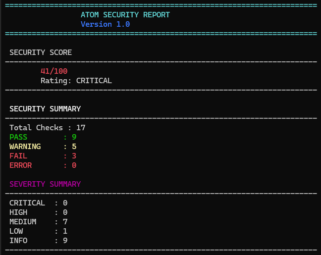
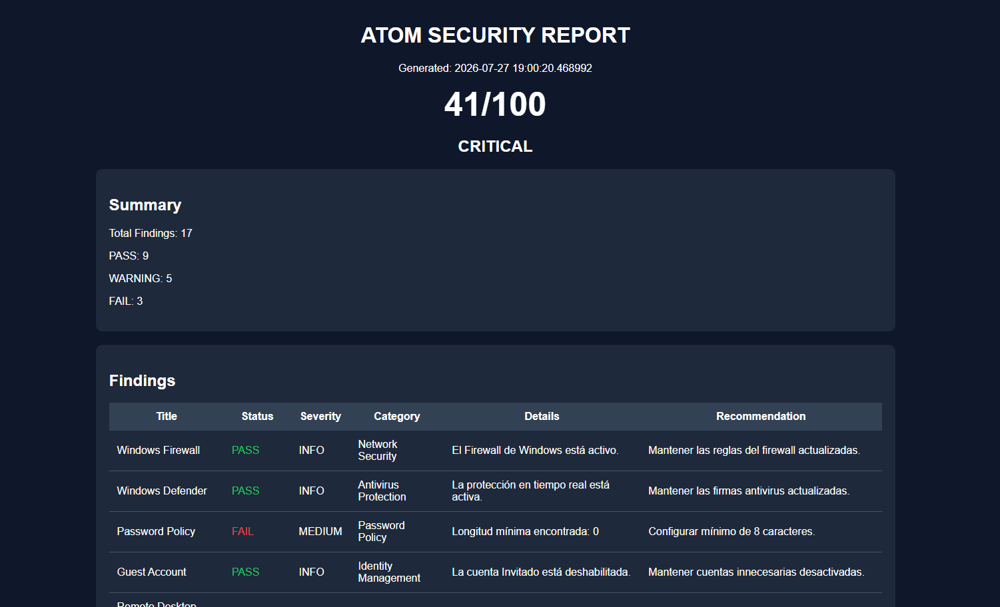

<div align="center">
  <h1>Atom Hardening Tool</h1>
  <p><b>Automated Security Auditing Framework for Windows and Linux</b></p>

  [](https://www.python.org/)
  [](https://opensource.org/licenses/MIT)
  []()
  []()
</div>

---

## 1. Overview

**Atom** is a mature, modular security auditing and hardening framework engineered to identify configuration weaknesses and systemic vulnerabilities across **Windows** and **Linux** environments.

By performing automated, deep-level configuration analysis, **Atom** generates normalized findings, enforces a structured **Security Score**, and outputs telemetry across multiple analytical formats (Console, TXT, JSON, HTML). The framework operates via an OS-centric module design, executing dynamic security checks dynamically based on the underlying runtime environment.

---

## 2. Framework Architecture

The core architecture eliminates fragmented standalone auditors in favor of unified, OS-specific modules. Audits such as **SSH** or **File Security** are injected as abstracted *checks* within their respective OS auditor.

### Directory Structure

```text
ATOM
├── main.py
├── AtomInterface
├── AuditRunner
├── AuditorFactory
├── BaseAuditor
├── Core
│   ├── SecurityScore
│   └── SecuritySummary
├── Models
│   └── Finding
├── Reporters
│   ├── ConsoleReporter
│   ├── TextReporter
│   ├── JSONReporter
│   └── HTMLReporter
└── Modules
    ├── Windows
    │   ├── Auditor
    │   └── Checks
    └── Linux
        ├── Auditor
        └── Checks
```

### Execution Pipeline

```text
[ START ] -> AtomInterface -> main.py -> AuditRunner -> AuditorFactory
                                                              |
    +---------------------------------------------------------+
    |
    v
[ OS DETECTED ] -> (WindowsAuditor | LinuxAuditor)
                         |
                         v
                  Security Checks
                         |
                         v
                  Finding Objects
                         |
    +--------------------+--------------------+
    |                                         |
    v                                         v
SecurityScore                          SecuritySummary
    |                                         |
    +--------------------+--------------------+
                         |
                         v
             (Console | TXT | JSON | HTML)
```

---

## 3. Auditing Capabilities

Upon execution, the framework utilizes OS detection to load the corresponding auditor matrix.

### Supported Security Checks

| Category | WindowsAuditor Checks | LinuxAuditor Checks |
| :--- | :--- | :--- |
| **System Identity** | Administrator & Guest Accounts | Users and Accounts |
| **Access Control** | UAC, PowerShell Policy, Passwords | Root Login, Auth Protocols |
| **Network & Comms** | Windows Firewall, SMBv1, LLMNR | Linux Firewall, Network Services |
| **Defense Mechanisms** | Windows Defender, BitLocker | System Services |
| **Configuration** | Updates, DNS over HTTPS | Critical System Configurations |
| **File Security** | File Security / NTFS Permissions | Sensitive Files, File Permissions |
| **SSH Sub-system** | SSH Configuration | SSH Service Status & Config |

---

## 4. Telemetry and Reporting

**Atom** generates standardized outputs tailored for rapid tactical response and strategic integration.

| Reporter Type | Principal Application | Output Features |
| :--- | :--- | :--- |
| **Console** | Real-time Operations | Color-coded severity (PASS, FAIL), immediate metric visibility. |
| **TXT** | Local Logging | Flat-file structure for persistent local auditing logs. |
| **JSON** | Automation & SIEM | Fully normalized schema designed for API/backend ingestion. |
| **HTML** | Executive Dashboards | Graphical interface plotting the Security Score and vulnerability matrix. |

### Normalized Finding Schema

```json
{
    "title": "Windows Firewall",
    "status": "PASS",
    "severity": "INFO",
    "category": "Network Security",
    "module": "WindowsAuditor",
    "recommendation": "Maintain the firewall enabled.",
    "reference": "CIS 1.2",
    "timestamp": "2026-10-15T10:30:00Z"
}
```

---

## 5. Security Score Metric

The framework quantifies the system's security posture via a progressive **Security Score** algorithm. Deductions are enforced based on finding severity.

> **SECURITY SCORE: 78/100**  
> **STATUS: MODERATE**

| Severity Level | Point Deduction |
| :--- | :--- |
| **CRITICAL** | - 25 |
| **HIGH** | - 15 |
| **MEDIUM** | - 8 |
| **LOW** | - 3 |
| **INFO** | 0 |

---

## 6. Deployment & Execution

### Prerequisites
- **Windows**: Elevated Privileges (`Administrator`)
- **Linux**: Root Privileges (`sudo`)

### Repository Deployment

```bash
git clone https://github.com/GaboX280/Atom-Hardening.git
cd Atom-Hardening
python main.py
```

---

## 7. Operational Visualization

| Interface Phase | Preview |
| :--- | :--- |
| **Main Interface** |  |
| **Audit Execution** |  |
| **Security Score** |  |
| **Terminal Summary** |  |
| **Security Report (TXT/JSON)** |  |
| **HTML Web Report** |  |

---

## 8. Strategic Roadmap

**Operational Milestones Achieved:**
- Modular OS-centric architecture deployment.
- Unified Windows and Linux auditing sub-systems.
- Automated OS detection and routing.
- Integration of SSH and File Security as embedded architecture checks.
- Robust, normalized multi-format reporting (JSON, HTML, etc.).
- Centralized Data Model (`Finding Object`).

**Development Pipeline:**
- CI/CD Automated Testing implementations.
- CIS Benchmark mapping integration.
- CVE/CIS cross-referencing for findings.
- Standalone binary packaging for rapid deployment (Windows & Linux).
- Web Dashboard expansion.
- Plugin sub-system integration.

---

## 9. Disclaimer

**Atom** is an open-source framework developed exclusively for educational research and authorized security posture assessment. Execution of automated auditing and hardening scripts must be strictly confined to owned infrastructure or environments operating under explicit authorization. The repository maintainer claims no liability for unauthorized deployment.