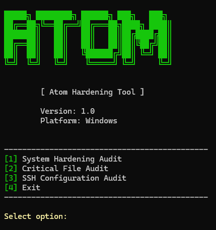
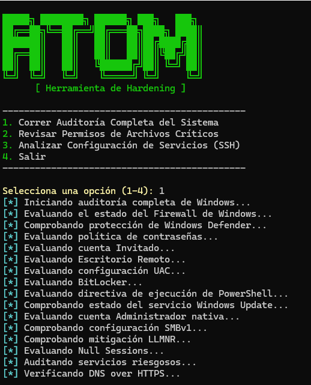
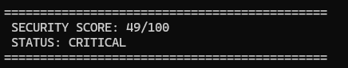
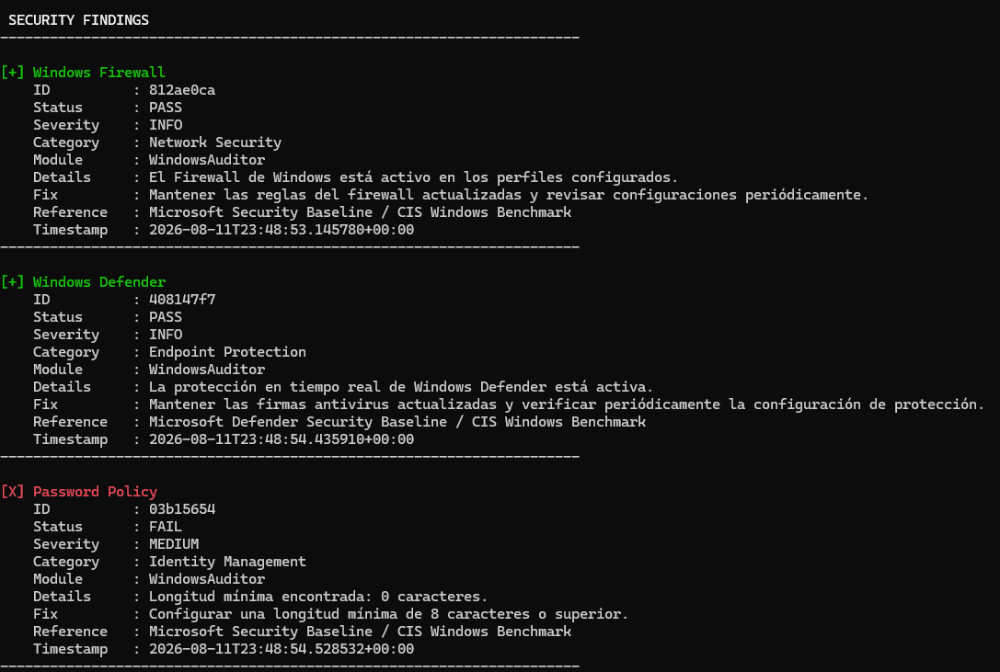

# Atom Hardening Tool

<p align="center">
  <b>Automated Security Auditing Framework for Windows and Linux</b>
</p>

<p align="center">
  Version: 1.0
</p>

---

# Descripción

**Atom** es una herramienta modular de auditoría y hardening desarrollada en Python orientada a identificar debilidades de configuración en sistemas Windows y Linux.

Su objetivo es analizar configuraciones críticas, generar hallazgos estructurados y proporcionar recomendaciones de seguridad para mejorar la postura del sistema.

Atom utiliza una arquitectura basada en módulos independientes, permitiendo agregar nuevos auditores sin modificar el núcleo principal de la aplicación.

---

# Características

## Auditoría de Sistemas

Evaluación de configuraciones críticas del sistema operativo.

## Windows Hardening Audit

Actualmente incluye:

- Firewall de Windows
- Windows Defender
- Políticas de contraseña
- Cuenta Guest
- Cuenta Administrator
- User Account Control (UAC)
- BitLocker
- Windows Update
- PowerShell Execution Policy
- SMBv1
- LLMNR
- Restricciones de acceso anónimo
- Servicios con superficie de ataque elevada
- DNS over HTTPS


---

# Auditoría de Archivos

Evaluación de protección sobre archivos críticos del sistema:

- Permisos NTFS
- Protección de archivos sensibles
- Análisis de archivos como:
  - SAM
  - Hosts


---

# Auditoría SSH

Evaluación de configuración y exposición SSH.

Incluye:

- Estado del servicio SSH
- Configuración SSH
- Root Login
- Password Authentication
- Exposición de puertos SSH
- OpenSSH en Windows


---

# Reportes

Atom genera reportes en múltiples formatos:

## Console Report

Reporte visual en terminal con:

- Estados PASS / WARNING / FAIL
- Severidad
- Categorías
- Recomendaciones


## TXT Report

Generación automática de reportes almacenados localmente.


## JSON Report

Salida estructurada para integración futura con:

- Dashboards
- SIEM
- Sistemas externos de monitoreo


Ejemplo:

```json
{
    "title": "Windows Firewall",
    "status": "PASS",
    "severity": "INFO",
    "module": "WindowsAuditor"
}
```

---

# Arquitectura

Atom utiliza una arquitectura modular basada en componentes independientes.

```
ATOM

│
├── main.py
│
├── AuditRunner
│
├── AuditorFactory
│
├── BaseAuditor
│
├── Models
│   └── Finding
│
├── Utils
│   ├── SecurityScore
│   └── SecuritySummary
│
├── Reporters
│   ├── ConsoleReporter
│   ├── TextReporter
│   └── JSONReporter
│
└── Modules

    ├── Windows
    │
    ├── Linux
    │
    ├── File Audit
    │
    └── SSH
```

---

# Flujo de ejecución

```
Usuario

  |
  v

AuditRunner

  |
  v

AuditorFactory

  |
  v

Auditor seleccionado

  |
  v

Security Checks

  |
  v

Finding Objects

  |
  +----------------+
  |                |
  v                v

Security       Reporters
Score
```

---

# Sistema de Findings

Cada hallazgo generado por Atom contiene información estructurada:

| Campo | Descripción |
|---|---|
| Title | Nombre del hallazgo |
| Status | PASS / WARNING / FAIL / ERROR |
| Severity | Nivel de impacto |
| Category | Área de seguridad afectada |
| Module | Auditor responsable |
| Recommendation | Acción recomendada |
| Reference | Referencia de seguridad |
| Timestamp | Fecha de detección |

---

# Security Score

Atom calcula una puntuación de seguridad basada en la severidad de los hallazgos encontrados.

Ejemplo:

```
SECURITY SCORE: 78/100

STATUS:
MODERATE
```

Sistema de penalización:

| Severidad | Penalización |
|-|-|
| CRITICAL | -25 |
| HIGH | -15 |
| MEDIUM | -8 |
| LOW | -3 |
| INFO | 0 |

---

# Screenshots

## Main Interface




## Windows Security Audit




## Security Score




## Security Results



---

# Tecnologías utilizadas

- Python 3.x
- PowerShell
- Bash
- Git
- Programación Orientada a Objetos
- Arquitectura modular
- Dataclasses
- JSON Processing


---

# Instalación

Clonar repositorio:

```bash
git clone https://github.com/GaboX280/Atom-Hardening.git
```

Entrar al proyecto:

```bash
cd Atom-Hardening
```

Ejecutar:

```bash
python main.py
```

> Se requieren privilegios Administrator en Windows o Root en Linux.


---

# Uso

Al iniciar Atom:

```
ATOM HARDENING TOOL

[1] System Hardening Audit
[2] Critical File Audit
[3] SSH Configuration Audit
[4] Exit
```

Seleccionar el módulo deseado y esperar la generación del reporte.


---

# Roadmap

## Completado

- [x] Arquitectura modular
- [x] Windows Hardening Audit
- [x] SSH Audit
- [x] File Permission Audit
- [x] Finding Object Model
- [x] Security Score
- [x] Security Summary
- [x] Console Reporter
- [x] TXT Reporter
- [x] JSON Reporter


## Próximamente

- [ ] Reportes HTML
- [ ] Tests automatizados
- [ ] Mapeo CIS Benchmark
- [ ] Referencias CVE/CIS por hallazgo
- [ ] Empaquetado ejecutable Windows
- [ ] Empaquetado ejecutable Linux
- [ ] Sistema de plugins
- [ ] Dashboard Web


---

# Disclaimer

Atom es una herramienta desarrollada con fines educativos y de investigación en seguridad informática.

Debe utilizarse únicamente en sistemas propios o con autorización explícita.